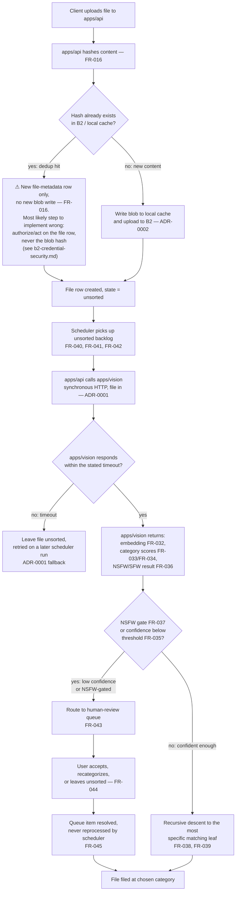

# Activity diagram: upload → classify → file

Covers a file's path from upload through classification to being filed
into the category tree, per issue #27. The `apps/api` ↔ `apps/vision`
call follows ADR-0001's contract exactly: synchronous HTTP, file in,
structured prediction out, no shared database access, a stated timeout.
FR IDs reference `organizational/requirements/functional-requirements.md`.

## Notes

- The dedup fork (`C`/`D`) is the step most likely to be implemented
  wrong, matching `organizational/deploy/b2-credential-security.md`'s
  own warning: authorization and file operations must resolve through
  the **file-metadata row**, never accept a content hash directly from a
  caller. A dedup hit creates a new row pointing at an existing blob — it
  must never skip creating that row, and no code path may act on the
  hash alone.
- The timeout branch (`I`) exists because `apps/vision` holds no queue
  of its own and no retry state — per ADR-0001, `apps/api` owns the
  timeout and the fallback (leave unsorted, retried on a later scheduler
  run) rather than blocking indefinitely on a stalled call.
- The low-confidence branch (`L`/`M`/`N`/`O`) is the human-review queue
  from issue #51; a resolved queue item is marked so FR-045 holds and the
  scheduler never re-offers it.
